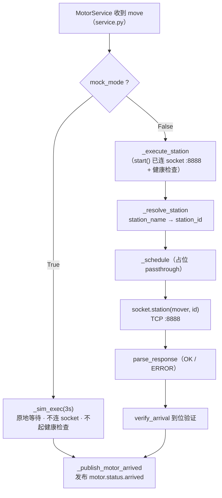
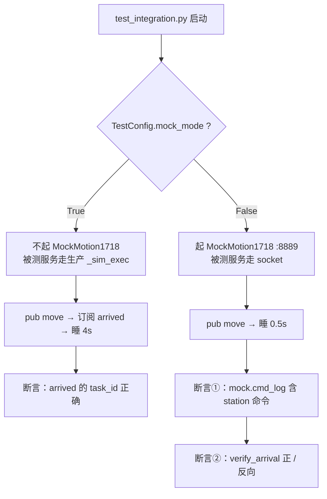

# 电机运输服务 (MotorService)

平面电机运输服务（MotorService），独立于设备体系运行，监听 NATS 指令，模拟/控制小车运输，完成后上报到达事件。

## 架构

```
Gateway/NATS ──(pub move/release)──→ MotorService ──(TCP :8888)──→ Motion_1718 ──(pmclib)──→ PMC
        ←──(sub motor.status.arrived)──
```

- **上行**：通过 NATS **通配符**订阅 `motor.control.>`（同时匹配 `move` / `release`）
- **下行**：
  - **mock 模式**（默认）：`_sim_exec(3s)` 模拟运输 → 发布 `motor.status.arrived`
  - **real 模式**：通过 TCP socket 长连接向 `Motion_1718` 下发 `station` 控制命令
- **不注册、不心跳、不参与设备生命周期**，可同时处理多台小车指令

## 通信架构（生产 vs 测试）

核心结论：**只有生产 real 模式和测试 real 档会走 socket；生产 mock 模式和测试 mock 档只到 `MotorService` 的 `_sim_exec` 就返回，不碰 socket。**

### 生产 · real 模式（`--mock-mode false`）

```
 云端调度 / Gateway
        │  NATS pub: bioflow.{t}.{e}.{l}.device._.motor.control.move
        ▼
┌─────────────────┐
│   NATS Server   │
└─────────────────┘
        │  通配符订阅 motor.control.>
        ▼
┌───────────────────────────────────────┐
│            MotorService               │
│  mock_mode = False                    │
│  _execute_station → SocketClient      │
└───────────────────────────────────────┘
        │  TCP 长连接 :8888（station <mover> <id>）
        ▼
┌───────────────────────────────────────┐
│        Motion_1718（真实硬件服务）      │
└───────────────────────────────────────┘
        │  pmclib
        ▼
┌───────────────────────────────────────┐
│         PMC（平面电机控制器）           │
└───────────────────────────────────────┘
        ▲
        └── 到位后上报 motor.status.arrived ──NATS──→ 云端
```

### 生产代码：move 指令处理流程（mock/real 分支）



### 集成测试代码：test_integration.py 流程（mock/real 分支）



### 生产 vs 测试：入口速查

| | 生产代码 | 集成测试代码 |
|---|---|---|
| 入口 | `main.py` | `tests/test_integration.py` |
| 配置 | `SchedulerConfig`（`config.py`） | `TestConfig`（继承 `SchedulerConfig`） |
| mock/real 开关 | CLI `--mock-mode` | CLI `--mock-mode`（或字段 `TestConfig.mock_mode`） |
| socket 端口 | `8888`（真机） | `8889`（MockMotion1718） |
| 是否有断言 | ❌ | ✅ |

### 生产 `mock_mode=True` 的作用

`mock_mode` 是 `SchedulerConfig` 里的字段，控制 **MotorService 自身的运行行为**：

- `start()`：**不连 socket**、**不起健康检查**；
- 收到 move：走 `_sim_exec(3s)` 原地等待（不下发任何指令），然后发布 `motor.status.arrived`。

一句话：**生产 mock 模式 = 服务在没有硬件时，自己把「收指令 → 运输 → 上报」跑通**，供联调 / 演示 / 开发用。此时没有断言，结果靠人看日志。

### 与集成测试 `mock_mode=True` 的区别

测试里的 `TestConfig.mock_mode` 和生产的 `SchedulerConfig.mock_mode` 是**同一个字段**（`TestConfig` 继承 `SchedulerConfig`）。测试的 `mock_mode=True` 会同时做三件事：

1. 让被测的 `MotorService` 以 mock 模式运行（**复用生产的 `_sim_exec`，测试没有自己的 mock 逻辑**）；
2. 测试**不启动** `MockMotion1718`；
3. 测试**断言** arrived 事件的 `task_id` 正确（而非检查 socket 命令）。

所以关键区别不是「怎么模拟」，而是「**谁来验证结果**」：

| | 生产 mock_mode=True | 集成测试 mock_mode=True |
|---|---|---|
| 走的生产代码 | `_sim_exec`（同一条路径） | 同左 |
| 是否起 MockMotion1718 | ❌ | ❌ |
| 谁验证结果 | 无人（人看日志） | 测试脚本（断言 `task_id`） |
| 结果反馈 | 无 | PASS / FAIL |

> 即：「测试的 mock 档」=「生产的 mock 模式」+ 一层断言——两者共用同一条 `_sim_exec` 生产代码，测试只是在其上「发指令 + 自动校验」。

### 谁走了 socket

| 场景 | NATS | MotorService | socket | 对端 |
|------|:---:|:---:|:---:|------|
| 生产 real | ✅ | ✅ | ✅ | 真实 Motion_1718 (:8888) |
| 生产 mock | ✅ | ✅ | ❌ | — |
| 集成测试 mock 档 | ✅ | ✅ | ❌ | — |
| 集成测试 real 档 | ✅ | ✅ | ✅ | MockMotion1718 (:8889) |
| NATS 单元测试 | ✅ | ❌ | ❌ | — |
| socket 手动测试 | ❌ | ❌ | ✅ | MockMotion1718 |

> `MockMotion1718` 永远是「真实 Motion_1718」的替身，只出现在 real 档测试里；生产 `mock_mode` 是「MotorService 内部跳过 socket」的开关，两者不是一个层面的东西。

## 目录结构

```
scheduler_service/
├── __init__.py           # 包入口
├── config.py             # SchedulerConfig — 连接参数 + station 映射表 + motor 配置
├── subjects.py           # NATS subject 构建（精确 + 通配符 + arrived + get_motor_action）
├── nats_client.py        # NatsClient — NATS 连接 / 订阅 / 发布（从 service.py 独立出来）
├── socket_client.py      # SocketClient — 长连接 TCP 通信 / 响应解析 / 到位验证
├── service.py            # MotorService — 业务逻辑（消息分发、simExec、socket 执行、arrived 上报）
├── main.py               # CLI 入口
├── tests/                # 模拟测试（无硬件）
│   ├── README.md             ← 测试总览
│   ├── test_integration.py   ← 集成测试入口
│   ├── unit_motion/          ← Mock TCP Server 手动测试
│   ├── unit_nats/            ← NATS 单元测试
│   └── integration/          ← 集成测试说明
└── README.md
```

## 启动顺序

```
① PMC 硬件 (192.168.0.50)
     ↓
② Motion_1718.py           # 连接 PMC，启动 socket server :8888
     ↓
③ NATS Server              # 消息中间件（可与②并行）
     ↓
④ MotorService             # 本服务
```

## 快速开始

```bash
# mock 模式（默认，无需硬件）
python -m Hardware.PlanarMotor.scheduler_service.main

# real 模式
python -m Hardware.PlanarMotor.scheduler_service.main --mock-mode false
```

## CLI 参数

| 参数 | 默认值 | 说明 |
|------|--------|------|
| `--nats-server` | `nats://10.169.30.21:4222` | NATS 服务器地址 |
| `--tenant` | `default` | 租户标识（bioflow 为硬编码平台前缀） |
| `--env` | `prod` | 环境标识 |
| `--lab` | `lab01` | 实验室标识 |
| `--socket-host` | `127.0.0.1` | Motion_1718 socket 地址（仅 real 模式） |
| `--socket-port` | `8888` | Motion_1718 socket 端口（仅 real 模式） |
| `--motor-name` | `planar_motor-1` | 电机标识名 |
| `--mock-mode` | `true` | 模拟模式：true=simExec(3s)，false=真实电机控制 |

## NATS 消息格式

### 订阅（通配符）

MotorService 使用单一通配符订阅，同时接收 move 和 release：

```
{tenant}.{env}.{lab}.device._.motor.control.>
```

action 从 `msg.subject` 提取（第 9 段，索引 8）。

### 发布（精确 subject）

发布端使用精确 subject：

```
{tenant}.{env}.{lab}.device._.motor.control.move      ← 发布 move
{tenant}.{env}.{lab}.device._.motor.control.release    ← 发布 release
{tenant}.{env}.{lab}.device._.motor.status.arrived     ← 上报到达
```

### Move Payload

```json
{
    "action":       "move",
    "move_type":    "pickup",
    "ip":           "192.168.0.50",
    "station_name": "station_02_pcr_01",
    "task_id":      "transport-001→pcr"
}
```

### Release Payload

```json
{
    "action":  "release",
    "ip":      "192.168.0.50",
    "task_id": "transport-001-pcr"
}
```

### Arrived Payload（上报）

```json
{
    "task_id":   "transport-001→pcr",
    "device_id": "planar_motor-1",
    "timestamp": "2026-08-11T14:08:35+00:00"
}
```

## Station 映射

在 `config.py` 的 `device_to_station` 字典中维护：

```python
device_to_station = {
    "station_02_pcr_01":    2,   # PCR 设备 → Station 2
    "station_04_sealer_01": 4,   # 封膜机   → Station 4
}
```

## 健康检查（仅 real 模式）

后台每 10 秒发送 `status` 检测 socket 连通性，**静默模式**——仅在状态变化（断连/恢复）时记录日志。

## 测试与运行方式

「跑服务」与「跑测试」是两回事，别混淆：

| 方式 | 入口 | 有断言 | mock/real 开关 |
|------|------|-------|---------------|
| 运行服务（联调/演示，无断言） | `python -m ...main` | ❌ | `--mock-mode`（默认 true） |
| 集成测试（端到端） | `tests/test_integration.py` | ✅ | `--mock-mode`（默认 true） |
| NATS 单元测试 | `tests/unit_nats/test_nats_pubsub.py` | ✅ | 不涉及 |
| socket 协议测试（手动） | `tests/unit_motion/mock_motion_1718.py` | ❌ | 不涉及 |

自动化测试（无硬件）：

```bash
# 终端 1：启动 NATS
nats-server

# 终端 2：集成测试（默认 mock 模式）
python -m Hardware.PlanarMotor.scheduler_service.tests.test_integration

# NATS 单元测试
python -m Hardware.PlanarMotor.scheduler_service.tests.unit_nats.test_nats_pubsub
```

> `main.py` 是把服务真跑起来（供联调/演示），不是测试；要「有断言的验证」用 `tests/` 下的测试文件。
> mock / real 的区别、`MockMotion1718` 与生产 `mock_mode` 的关系见 [tests/README.md](tests/README.md)。

## 依赖

- Python 3.11+
- [nats-py](https://pypi.org/project/nats-py/) (`pip install nats-py`)
