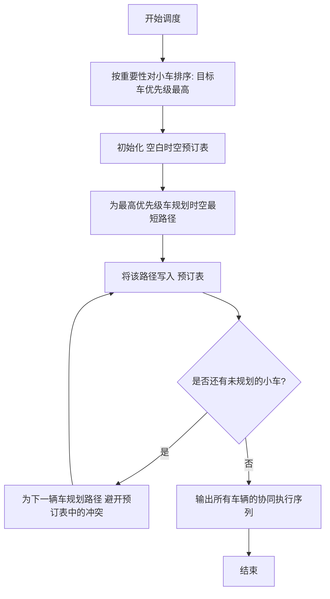

# 单轨多 AGV 协同调度系统方案设计

## 1. 问题背景与描述

本系统应用于磁悬浮平面电机场景。定子模块（Stator Tile）平铺构成水平工作面，动子（Mover，即小车/AGV）通过磁悬浮方式悬浮于定子表面，沿定子模块排列方向（轨道）运动。由于大部分定子模块宽度受限（长方形模块仅容纳单动子通过），无法支持两台小车并排通行。为了解决对头冲突，系统设计了少量的正方形宽轨定子模块作为错车点。

如何协同调度多辆小车（动子），使得目标小车以最快速度到达终点，同时其他小车主动避让，是提高物流效率的核心问题。

### 场景示意图

轨道地图由水平排列的两种定子模块（Tile）组成：

- **长方形定子模块 (R)**：单轨，宽度为 $b$（短边），每次只能承载 1 辆小车（动子尺寸为 $b \times b$ 的正方形，恰好占满 R 模块宽度，无法并排）。
- **正方形定子模块 (S)**：双轨，边长为 $2b$（为长方形短边的 2 倍），可作为临时错车点，最多同时承载 2 辆小车。

```
轨道拓扑:
 [ R: 0 ] === [ R: 1 ] === [ S: 2 ] === [ R: 3 ] === [ R: 4 ]
 (容量: 1)    (容量: 1)    (容量: 2)    (容量: 1)    (容量: 1)
                            ^
                         避让错车点
```

### 系统动子（小车）数量限制

**本场景最多支持 3 台动子（小车）同时运行。**

原因如下：在地图 `[R, R, S, R, R]` 中，共有 4 个长方形单轨模块（各容量 1）和 1 个正方形双轨模块（容量 2），总物理容量为 $4 \times 1 + 1 \times 2 = 6$。但容量上限并不等于可安全调度的小车数量：

1. **对头冲突需要缓冲空间**：当两台小车相向而行时，至少需要 1 个空余位置供其中之一退入避让。如果所有 R 模块都被占满，任何对头冲突都无法化解，系统立即死锁。
2. **仅 1 个错车点 (S2)**：S2 是唯一的双向通行+并排停放点。当需要错车时，一台小车退入 S2，另一台从相邻 R 模块通过。如果小车数量 ≥ 4，在极端情况下（如所有小车同时相向运动），S2 的 2 个位置不足以同时缓冲所有冲突。
3. **安全上界推导**：考虑最坏情况——3 台小车中任意两台对头冲突时：
   - 1 台占用 S2 的一个位置避让
   - 1 台通过 S2 的另一位置继续前行
   - 第 3 台在远端 R 模块等待
   - 始终至少有 1 个空余 R 模块作为调度缓冲

因此，**3 台动子（小车）**是本拓扑结构下可安全协同调度的最大数量。

## 2. 系统建模

为了进行数学求解，我们将物理世界抽象为离散的时空网格模型：

### 2.1 地图建模

**空间离散化**：地图表示为一维数组 $L = [T_0, T_1, \dots, T_{n-1}]$。

**容量约束 (Capacity)**：

$$
\text{Capacity}(T_i) =
\begin{cases}
1, & \text{if } T_i \text{ is Rectangle (R)} \\
2, & \text{if } T_i \text{ is Square (S)}
\end{cases}
$$

### 2.2 小车建模

**状态表示**：每辆车拥有状态 $\text{State} \in \{\text{IDLE}, \text{MOVING}\}$。

**时间步 (Time Step)**：时间被离散化为 $t = 0, 1, 2, \dots$。在每个时间步，小车可执行以下动作之一：

- **Stay**：停留在当前 Tile。
- **Move**：移动到相邻的左/右 Tile（即 $pos_{t+1} = pos_t \pm 1$）。

### 2.3 安全与冲突约束

- **点冲突 (Vertex Conflict)**：在任意时刻 $t$，任何 Tile 上的车辆总数不能超过其容量上限。
- **边冲突/对头碰撞 (Edge Conflict)**：在相邻时刻 $t \to t+1$ 之间，两辆车不能在长方形 Tile (R) 上进行对向位置交换。

## 3. 协同调度算法：基于优先级规划的时空 A*

我们采用 **优先级规划 (Prioritized Planning)** 结合 **时空 A\* (Space-Time A\*)** 的协同调度算法。



### 核心机制：时空预订表 (Reservation Table)

预订表是一个三维账本，记录了 `(时间 t, 位置 x)` 占用的车辆 ID。

- 高优先级的车先写入账本。
- 低优先级的车后规划，必须视账本上的记录为"移动的墙"，主动寻找错车点避让。

## 4. 协同调度效果演示

### 4.1 测试场景设定

- **地图**：`[R, R, S, R, R]`（索引 2 为正方形错车点）。
- **目标车 (ID 99)**：从 0 出发，目的地 4（优先级最高）。
- **协同车 (ID 1)**：初始在 3，目的地 3（需要在原地等待或避让）。

### 4.2 调度执行时间步对照表

| 时间步 (T) | 目标车 99 (0 → 4) | 协同车 1 (3 → 3) | 调度动作与状态说明 |
|:----------:|:-----------------:|:-----------------:|:-------------------|
| T = 0 | 位置 0 (R) | 位置 3 (R) | 初始状态，两车对头 |
| T = 1 | 位置 1 (R) | 位置 2 (S) | 协同车 1 预测到冲突，主动向左退一步进入错车点 |
| T = 2 | 位置 2 (S) | 位置 2 (S) | 两车在正方形错车点成功会师（容量为 2，安全错车） |
| T = 3 | 位置 3 (R) | 位置 2 (S) | 目标车继续前进，协同车在错车点等待 |
| T = 4 | 位置 4 (R) [到达] | 位置 3 (R) | 目标车到达终点，协同车返回原位 |

## 5. 核心 Python 实现代码

```python
import heapq


class Tile:
    def __init__(self, index: int, is_square: bool):
        self.index = index
        self.is_square = is_square
        self.capacity = 2 if is_square else 1


class Car:
    def __init__(self, car_id: int, start: int, goal: int, priority: int):
        self.id = car_id
        self.start = start
        self.goal = goal
        self.priority = priority


class CooperativeScheduler:
    def __init__(self, map_layout: list[Tile]):
        self.map = map_layout
        self.num_tiles = len(map_layout)
        self.reservation = {}  # 格式: {(time, pos): set(car_ids)}
        self.max_horizon = 20

    def reserve_path(self, car_id: int, path: list[int]):
        for t, pos in enumerate(path):
            self.reservation.setdefault((t, pos), set()).add(car_id)
        # 抵达终点后持续占用
        for t in range(len(path), self.max_horizon):
            self.reservation.setdefault((t, path[-1]), set()).add(car_id)

    def plan_single_car(self, car: Car) -> list[int]:
        open_set = [(abs(car.start - car.goal), 0, car.start)]
        came_from = {}
        g_score = {(car.start, 0): 0}

        while open_set:
            _, t, curr = heapq.heappop(open_set)

            if curr == car.goal:
                # 确保未来停留在终点时不会被撞
                if all(
                    len(self.reservation.get((ft, curr), set()) - {car.id})
                    + 1
                    <= self.map[curr].capacity
                    for ft in range(t + 1, self.max_horizon)
                ):
                    path = []
                    state = (curr, t)
                    while state in came_from:
                        path.append(state[0])
                        state = came_from[state]
                    path.append(car.start)
                    return path[::-1]

            for next_pos in [curr, curr - 1, curr + 1]:
                if not (0 <= next_pos < self.num_tiles) or t + 1 >= self.max_horizon:
                    continue

                # 1. 容量检查
                existing = self.reservation.get((t + 1, next_pos), set())
                if len(existing - {car.id}) + 1 > self.map[next_pos].capacity:
                    continue

                # 2. 对头碰撞检查
                if next_pos != curr:
                    opposing = self.reservation.get(
                        (t, next_pos), set()
                    ) & self.reservation.get((t + 1, curr), set())
                    if opposing and not (
                        self.map[curr].is_square and self.map[next_pos].is_square
                    ):
                        continue

                tentative_g = g_score[(curr, t)] + 1
                if (next_pos, t + 1) not in g_score or tentative_g < g_score[
                    (next_pos, t + 1)
                ]:
                    g_score[(next_pos, t + 1)] = tentative_g
                    f_score = tentative_g + abs(next_pos - car.goal)
                    came_from[(next_pos, t + 1)] = (curr, t)
                    heapq.heappush(open_set, (f_score, t + 1, next_pos))

        return [car.start] * self.max_horizon


# 测试运行
if __name__ == "__main__":
    # 初始化地图
    tiles = [
        Tile(0, is_square=False),
        Tile(1, is_square=False),
        Tile(2, is_square=True),
        Tile(3, is_square=False),
        Tile(4, is_square=False),
    ]

    # 初始化小车
    cars = [Car(99, 0, 4, 0), Car(1, 3, 3, 1)]

    # 调度计算
    scheduler = CooperativeScheduler(tiles)
    for c in sorted(cars, key=lambda x: x.priority):
        path = scheduler.plan_single_car(c)
        scheduler.reserve_path(c.id, path)
        print(f"车辆 {c.id} 路径: {path}")
```
